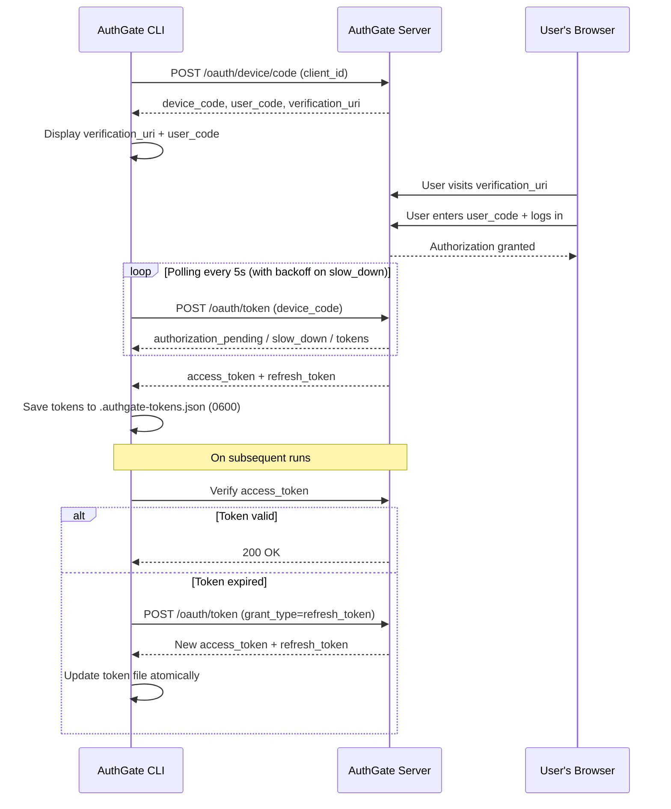

# AuthGate CLI - OAuth 2.0 Device Flow Client

[](https://github.com/go-authgate/device-cli/actions/workflows/security.yml)
[](https://github.com/go-authgate/device-cli/actions/workflows/testing.yml)

A CLI tool for authenticating with AuthGate server via OAuth 2.0 Device Authorization Flow ([RFC 8628](https://datatracker.ietf.org/doc/html/rfc8628)). Designed for headless environments, SSH sessions, and scenarios where browser-redirect flows are impractical.

**Key capabilities:** token storage with multi-client support · automatic token refresh · RFC 8628-compliant polling with exponential backoff · TLS 1.2+ enforcement

---

## Table of Contents

- [AuthGate CLI - OAuth 2.0 Device Flow Client](#authgate-cli---oauth-20-device-flow-client)
  - [Table of Contents](#table-of-contents)
  - [Prerequisites](#prerequisites)
  - [Quick Start](#quick-start)
  - [Configuration](#configuration)
  - [Device Flow Architecture](#device-flow-architecture)
  - [How to Use](#how-to-use)
    - [First Time Login](#first-time-login)
    - [Subsequent Runs](#subsequent-runs)
  - [Token Storage](#token-storage)
  - [Usage Examples](#usage-examples)
  - [Error Reference](#error-reference)
  - [Advanced Features](#advanced-features)
    - [Polling with Exponential Backoff](#polling-with-exponential-backoff)
    - [Context and Cancellation](#context-and-cancellation)
  - [Security](#security)
    - [HTTP Client](#http-client)
    - [Input Validation](#input-validation)
    - [Token File](#token-file)
    - [Error Handling](#error-handling)
    - [Best Practices](#best-practices)
  - [Troubleshooting](#troubleshooting)
  - [Development](#development)
  - [Learn More](#learn-more)

---

## Prerequisites

- **Go 1.21+** — required to build from source
- **AuthGate server** — must be running and accessible ([AuthGate Documentation](../../README.md))
- **Default server address**: `http://localhost:8080`

---

## Quick Start

```bash
# 1. Clone and build
git clone <repository-url>
cd device-cli
go build -o authgate-device-cli

# 2. Get your Client ID from the AuthGate server startup logs:
#    Client ID: xxxxxxxx-xxxx-xxxx-xxxx-xxxxxxxxxxxx

# 3. Run
./authgate-device-cli -client-id=<your-client-id>
```

---

## Configuration

Priority order: **Flag > Environment Variable > `.env` file > default**

| Parameter  | Flag          | Environment Variable | Default                 |
| ---------- | ------------- | -------------------- | ----------------------- |
| Client ID  | `-client-id`  | `CLIENT_ID`          | _(required)_            |
| Server URL | `-server-url` | `SERVER_URL`         | `http://localhost:8080` |
| Token File | `-token-file` | `TOKEN_FILE`         | `.authgate-tokens.json` |

**Example `.env` file:**

```env
CLIENT_ID=abc-123
SERVER_URL=http://localhost:8080
TOKEN_FILE=.authgate-tokens.json
```

```bash
./authgate-device-cli -h   # view all options
```

---

## Device Flow Architecture



---

## How to Use

### First Time Login

1. Run the tool with your client ID
2. The CLI displays a verification URL and user code:

   ```txt
   Please open this link to authorize:
   http://localhost:8080/device?user_code=ABC12345

   Or manually visit: http://localhost:8080/device
   And enter code: ABC12345
   ```

3. Open the URL in your browser
4. Log in to AuthGate (default: `admin` / check server logs for password)
5. Enter the user code when prompted
6. The CLI detects authorization automatically and saves your tokens

### Subsequent Runs

Tokens are saved locally after first login. The CLI will:

- Reuse valid access tokens
- Automatically refresh expired access tokens using the refresh token
- Start a new device flow only if refresh fails

---

## Token Storage

Tokens are stored in `.authgate-tokens.json` (configurable). A single file supports **multiple Client IDs**.

```json
{
  "tokens": {
    "client-id-1": {
      "access_token": "...",
      "refresh_token": "...",
      "token_type": "Bearer",
      "expires_at": "2026-01-20T12:00:00Z",
      "client_id": "client-id-1"
    },
    "client-id-2": {
      "access_token": "...",
      "refresh_token": "...",
      "token_type": "Bearer",
      "expires_at": "2026-01-20T13:00:00Z",
      "client_id": "client-id-2"
    }
  }
}
```

**Security properties:**

- Created with `0600` permissions (owner read/write only)
- Written atomically (temp file + rename) to prevent corruption
- File locking prevents race conditions with concurrent processes

> **Never commit this file to version control.** Add `.authgate-tokens.json` to `.gitignore`.

---

## Usage Examples

```bash
# First run — prompts for browser authorization
./authgate-device-cli -client-id=abc-123

# Subsequent runs — reuses saved tokens automatically
./authgate-device-cli -client-id=abc-123

# Custom server URL
./authgate-device-cli -client-id=abc-123 -server-url=https://auth.example.com

# Multiple clients — stored in same file by default
./authgate-device-cli -client-id=abc-123
./authgate-device-cli -client-id=xyz-789

# Multiple clients — separate token files
./authgate-device-cli -client-id=abc-123 -token-file=./work-tokens.json
./authgate-device-cli -client-id=xyz-789 -token-file=./personal-tokens.json
```

---

## Error Reference

The CLI handles all OAuth 2.0 Device Authorization Grant error codes defined in RFC 8628:

| Error                   | Meaning                                   | CLI Behaviour                                           |
| ----------------------- | ----------------------------------------- | ------------------------------------------------------- |
| `authorization_pending` | User has not authorized yet               | Continues polling, shows progress dots                  |
| `slow_down`             | Server requests slower polling            | Triggers exponential backoff (×1.5 multiplier, max 60s) |
| `expired_token`         | Device code expired (default: 30 minutes) | Stops polling, prompts to restart authentication        |
| `access_denied`         | User explicitly denied authorization      | Stops and displays denial message                       |
| Other errors            | Unexpected server errors                  | Stops and displays detailed error information           |

---

## Advanced Features

### Polling with Exponential Backoff

- **Initial interval**: 5 seconds (set by server)
- **Progress indicator**: dots printed every 2 seconds; newline every 50 dots
- **`slow_down` backoff**: interval multiplied by 1.5 on each signal, capped at 60s

```txt
Initial:        5.000s
1st slow_down:  7.500s
2nd slow_down: 11.250s
3rd slow_down: 16.875s
...
Maximum:       60.000s
```

### Context and Cancellation

- All operations respect Go context cancellation
- Graceful shutdown on `Ctrl+C`
- Request timeout: 30 seconds per HTTP call

---

## Security

### HTTP Client

| Protection          | Detail                                              |
| ------------------- | --------------------------------------------------- |
| Request timeout     | 30 seconds (prevents indefinite hangs)              |
| Minimum TLS version | TLS 1.2                                             |
| HTTP warning        | Warns automatically when server URL uses plain HTTP |
| Connection pooling  | Idle connection limits to manage resources          |

### Input Validation

- **`SERVER_URL`**: Validates URL format and scheme (`http`/`https` only)
- **`CLIENT_ID`**: Warns if value is not a valid UUID format

### Token File

- Permissions: `0600` (owner-only)
- Atomic writes: temp file + rename pattern
- File locking: prevents data corruption with concurrent access

### Error Handling

- All errors are checked — no silent failures
- Error chains preserve full context for debugging
- Token values are truncated or redacted in log output

### Best Practices

1. Add `.authgate-tokens.json` to `.gitignore`
2. Use HTTPS URLs in production — the CLI will warn if you don't
3. Delete token files when no longer needed
4. Review any security warnings printed at startup

---

## Troubleshooting

**`CLIENT_ID not set`**
Provide via `-client-id=<id>` flag, `CLIENT_ID` env var, or `.env` file. Find your ID in the AuthGate server startup logs.

**`connection refused`**
Start the AuthGate server in another terminal:

```bash
./bin/authgate server
```

Verify the server URL matches (default: `http://localhost:8080`).

**`token verification failed`**
The token was revoked or is invalid. Delete the token file and re-authenticate:

```bash
rm .authgate-tokens.json
./authgate-device-cli -client-id=<your-id>
```

**`refresh failed`**
The CLI will automatically start a new device flow. Follow the browser authorization steps again.

**Polling is slowing down**
Normal behavior — the server returned a `slow_down` signal. The CLI has automatically increased its polling interval. See [Error Reference](#error-reference).

**`context deadline exceeded`**
A request timed out (30s limit). Check your network connection and server availability.

---

## Development

```bash
# Run tests
go test ./...

# Build binary
go build -o authgate-device-cli

# Build with version info
go build -ldflags="-X main.version=1.0.0" -o authgate-device-cli
```

---

## Learn More

- [RFC 8628 — OAuth 2.0 Device Authorization Grant](https://datatracker.ietf.org/doc/html/rfc8628)
- [AuthGate Documentation](../../README.md)

For issues or questions, please open an issue on the project repository.
